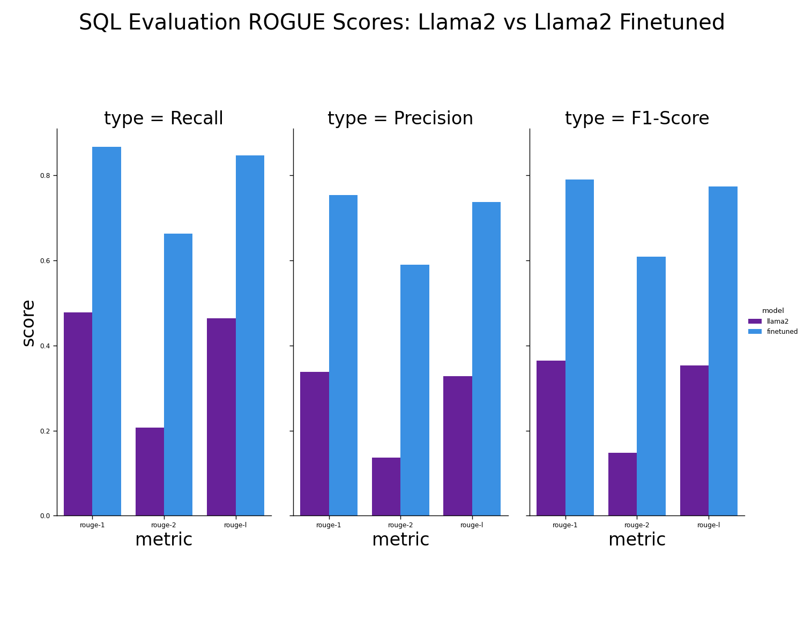

#   LLMs for SQL Generation

The following repo contains files to Finetune and Evaluate an LLM for Text to SQL tasks. We see a 2x improvement in ROGUE-1 and ROGUE-L scores and a 3x improvement in ROGUE-2 scores from fine-tuning. Also we found great improvements in Exact Match accuarcy and Execution Accuracy from fine -tunning against base model  These big ROGUE performance improvements demonstrate the value of fine-tuning (see figure below).

  

---

##  Repository Contents

| Notebook | Description | Requirements |
|----------|-------------|--------------|
| `0_Text2SQL_Create_Datav3.ipynb` | Prepares training and test datasets. | 💻 CPU |
| `1_Text2SQL_FineTune_Llama2GPTQv3.ipynb` | Fine-tunes the LLama2-GPTQ model on training data (~20 mins). | ⚡ GPU |
| `2a_Text2SQL_Evaluate_Llama2GPTQv3.ipynb` | Runs inference using the **base model** on test data (~40 mins). | ⚡ GPU |
| `2b_Text2SQL_Evaluate_Llama2GPTQFineTunev3.ipynb` | Runs inference using the **fine-tuned model** (~40 mins). | ⚡ GPU |
| `2c_Text2SQL_Compare_ROGUEv3.ipynb` | Computes ROUGE-1, ROUGE-2, and ROUGE-L scores for base vs fine-tuned model. | 💻 CPU |
| `3_Text2SQL_HFUpload_Llama2GPTQFineTunev3.ipynb` | Uploads your fine-tuned model to the Hugging Face Hub (**Work in Progress**). | ⚡ GPU |

---

##  Evaluation Strategy

Currently, model outputs are evaluated using **ROUGE metrics**. However, we recommend implementing a **database-execution-based evaluation** for more accurate validation of SQL generation (coming soon 🚧).

---

